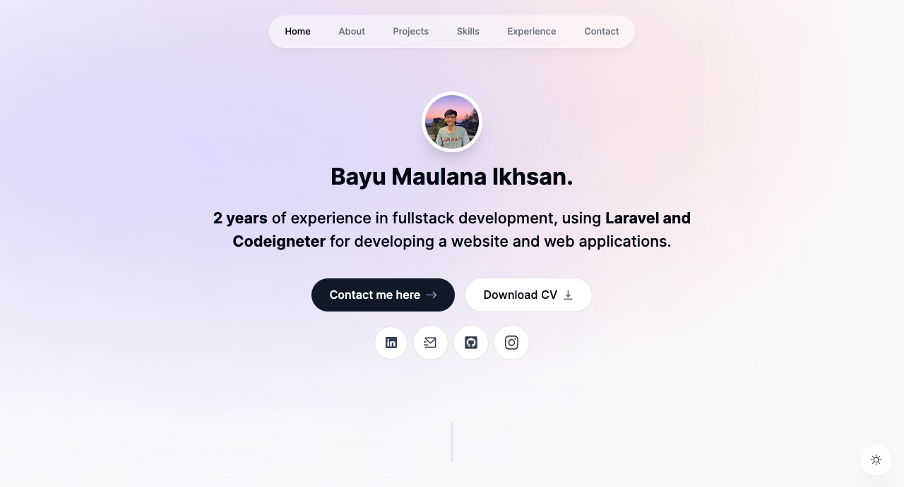

# Portfolio Website



## Description

This repository contains the codebase for my personal portfolio website, built using Next.js, Tailwind CSS, and Framer Motion. The website aims to showcase my projects, works, and experiences across various domains. With an appealing layout and smooth animations, the website is designed to provide an engaging experience for visitors.

## Key Features

- **Responsive Design:** The website has been designed with a responsive layout, allowing visitors to explore my portfolio seamlessly across various devices.

- **Smooth Animations:** Leveraging Framer Motion, the website incorporates captivating and fluid animations on select elements throughout the site, enhancing the visual impression.

- **Intuitive Navigation:** Clear and intuitive navigation assists visitors in easily navigating through different sections of the portfolio, including individual projects, the About Me page, and contact information.

- **Detailed Project Sections:** Each project within the portfolio has a dedicated detailed page that explains its purpose, my contributions, and achieved outcomes. This aids visitors in comprehending projects comprehensively.

## Installation

1. **Clone Repository:** Clone this repository to your local directory using the following command:

```bash
  git clone https://github.com/Bayumaul/portofolio-next.git
```

2. **Install Dependencies:** Navigate to the newly cloned repository directory and run the following command to install all required dependencies:

```bash
  npm install
```

3. **Start Development Server:** Launch the development server with the following command:

```bash
  npm run dev
```

The server will run at http://localhost:3000.

## Live Website

Visit the live portfolio website at https://bayumaulanaikhsan.my.id/](https://bayumaulanaikhsan.my.id/).

## Contribution

Contributions in the form of pull requests are highly welcomed. If you wish to make changes to this website, please follow these steps:

1. Fork this repository.

2. Create a branch for the feature or improvement you intend to make:

```bash
  git checkout -b new-feature
```

3. Make changes to the code.

4. Commit your changes:

```bash
  git commit -m "Added new feature: feature description"
```

5. Push your branch to the remote repository:

```bash
  git push origin new-feature
```

6. Create a pull request to propose your changes.

## License

This project is licensed under the MIT License - see the [LICENSE](LICENSE) file for details.

---

Thank you for visiting my portfolio repository! Feel free to reach out to me via [email](mailto:bayu.maulanaikhsan123@gmail.com) if you have any questions or wish to collaborate.
